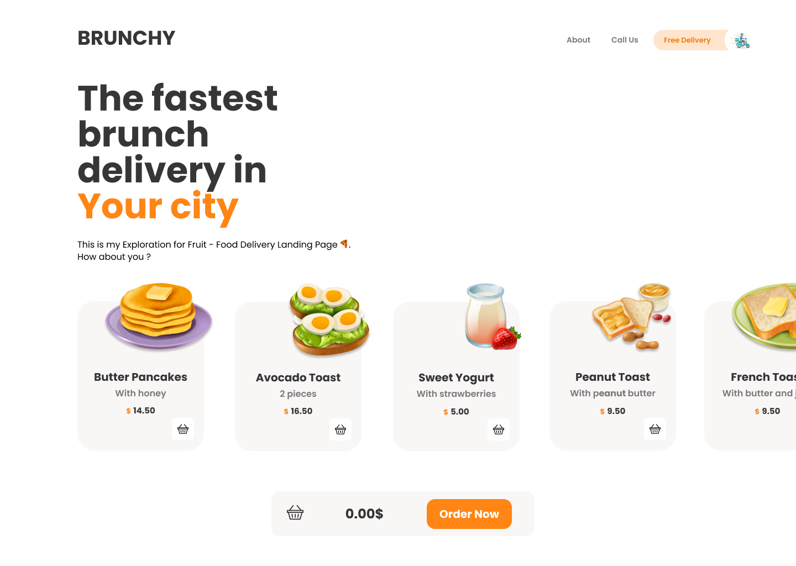
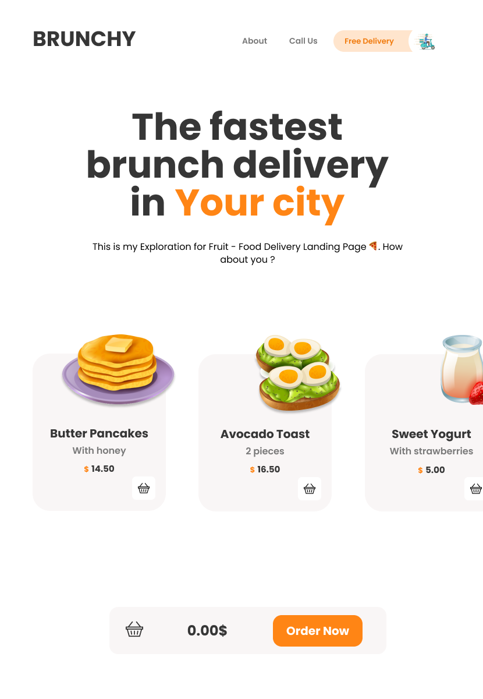
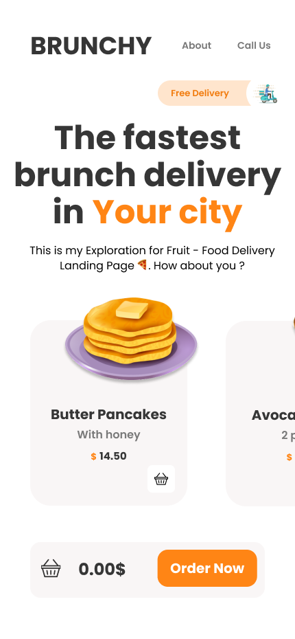

<h1 align="center">Welcome to Brunchy 👋</h1>
<p>
  <a href="https://github.com/mrchreesa/dreamshot-react-scss" target="_blank">
    
  </a>
  <a href="https://twitter.com/mrchreesa" target="_blank">
    
  </a>
</p>

Brunchy is a simple one page delivery app which allows users to choose their favourite brunch meal, then add it to a shopping cart, review the list of meals and place an order.
The app is fully responsive build with React and CSS modules with SASS.





<h1 align="center"> 🏠 (https://https://dreamshot-kristian.vercel.app/) </h1>
</br>
<p align="center">
 🔶🔶🔶 Technologies Used (https://github.com/mrchreesa/dreamshot-react-scss) 🔶🔶🔶
 </p>
<p align="center">
- HTML5
- CSS3
- JavaScript (ES6)
- React
- Sass (modules)
- Storybook
- Git
- GitHub
</p>

</br>

## Clone

```sh
$ git clone https://github.com/mrchreesa/dreamshot-react-scss
```

## Install

```sh
npm install
```

## Usage

```sh
npm start
```

## Run tests

```sh
npm test
```

## Author

👤 **Kristian Rahnev**

- Twitter: [@mrchreesa](https://twitter.com/mrchreesa)
- Github: [@mrchreesa](https://github.com/mrchreesa)
- LinkedIn: [@kristian-rahnev-90b35913a/](https://linkedin.com/in/kristian-rahnev-90b35913a/)

## Show your support

Give a ⭐️ for this project!
